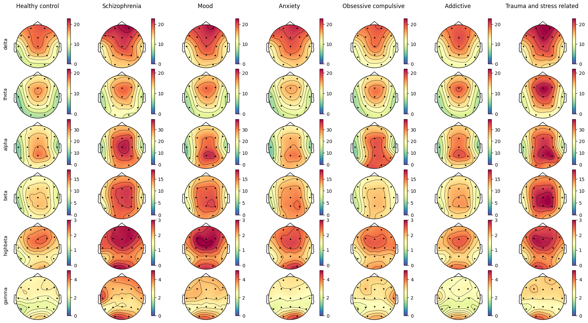

# Visualisation of QEEG data
This repo contains few functions to visualised pre-processed EEG data.
## visualising-pre-processed-eeg-data.ipynb
Jupyter notebook, contains most of detail on how to use functions for visualisations.
## EEG_channels.csv
Contains channel names and positions.
## eeg_viz.py
Contains functions for visualisations:  
* plot_eeg based on mne.viz.plot_topomap function.
* plot_eeg_dataset based on plot_eeg and visualises whole dataset with specific structure (look to the Jupyter notebook to see all the details).
## example_visualisation.py
Example of use for written functions. Produces this plot:
